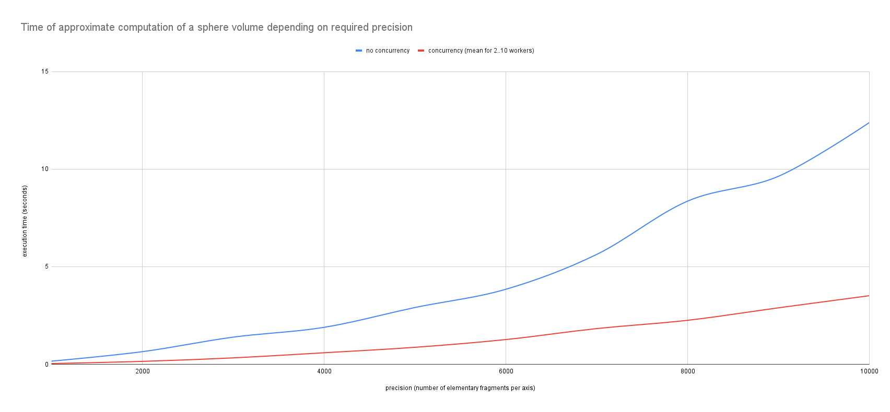
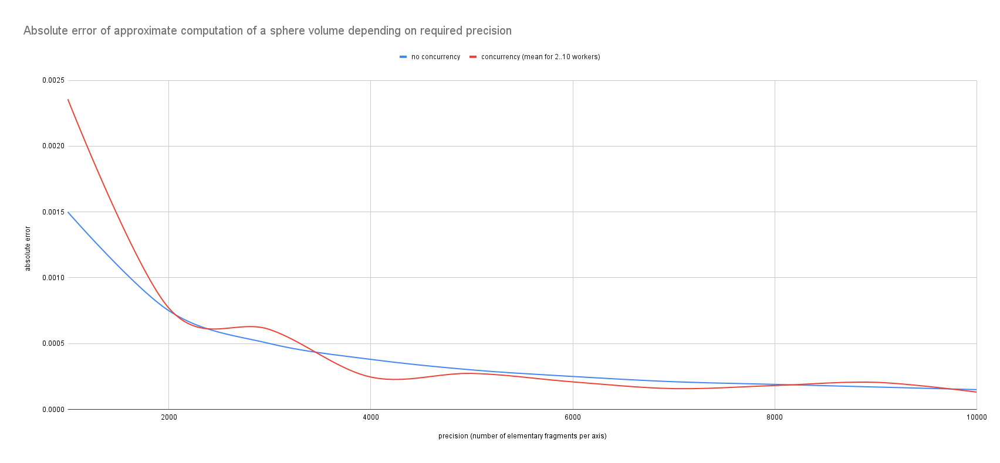

# nest

**N**umerical **est**imation tool - a library containing some basic functions for approximate computation of some mathematical values.




## Usage

Include into your global `dependencies` section in the `Package.swift` the following statement: 

```sh
.package(url: "https://github.com/zeionara/nest.git", .branch("oauth"))
```

Then for making it available in the source code of your modules you need to append the respective call for every desired product declaration as well:

```sh
.product(name: "nest", package: "nest")
```

After these prerequisites the library can be imported and it's components will become available:

```swift
import nest

public func constantFive(_ x: Double) -> Double {
    return Double(5.0)
}

let firstValue = 1.0
let lastValue = 3.0

let result = integrate(constantFive, from: firstValue, to: lastValue)

print("The integral of the constant function y = 5 from \(String(format: "%.3f", firstValue)) to \(String(format: "%.3f", lastValue)) is equal to \(String(format: "%.3f", result))!")

// Output: The integral of the constant function y = 5 from 1.000 to 3.000 is equal to 10.000!
```

## Building

The following command must be executed for packaging the library contents:

```sh
swift build --product nest
```
